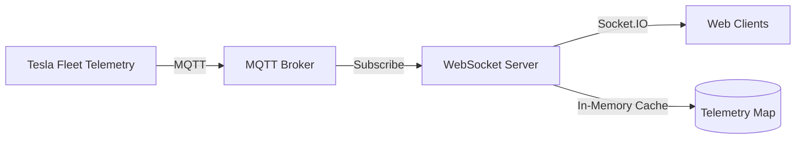

# Tesla Fleet Telemetry WebSocket Server

A real-time WebSocket server that subscribes to Tesla Fleet Telemetry data from an MQTT broker and streams it to connected clients.

## Architecture



The server subscribes to `tesla-fleet-telemetry/#` topics, parses incoming messages, and broadcasts them in real-time to all connected clients.

## MQTT Topic Structure

The server processes MQTT topics in the following format:

```
tesla-fleet-telemetry/{vin}/{type}/{key}
```

- `{vin}`: Vehicle Identification Number
- `{type}`: Message type (`v` = value)
- `{key}`: Telemetry data key

Only messages with `type` of `v` are forwarded to clients.

### Events

- `telemetry`: Receives telemetry data
  - On initial connection: All current telemetry data as an object
  - On updates: Only changed data as an object (`{ [key]: value }`)


## Requirements

- Node.js >= 18.0.0
- pnpm 10.11.0+
- MQTT Broker

## Installation

```bash
pnpm install
```

## Environment Variables

Create a `.env.local` file to configure the following environment variables:

```env
PORT=8080
MQTT_URL=mqtt://10.0.0.2:1883
```

## Usage

### Development Mode

```bash
pnpm dev
```

Development mode automatically restarts on file changes.

### Production Mode

```bash
pnpm start
```

## Docker Deployment

### Build Image

```bash
pnpm docker:build
```

### Run Container

```bash
docker run -d \
  -p 8080:8080 \
  -e MQTT_URL=mqtt://your-mqtt-broker:1883 \
  tesla-fleet-telemetry-websocket
```
